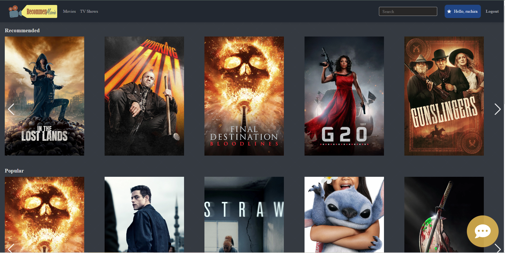
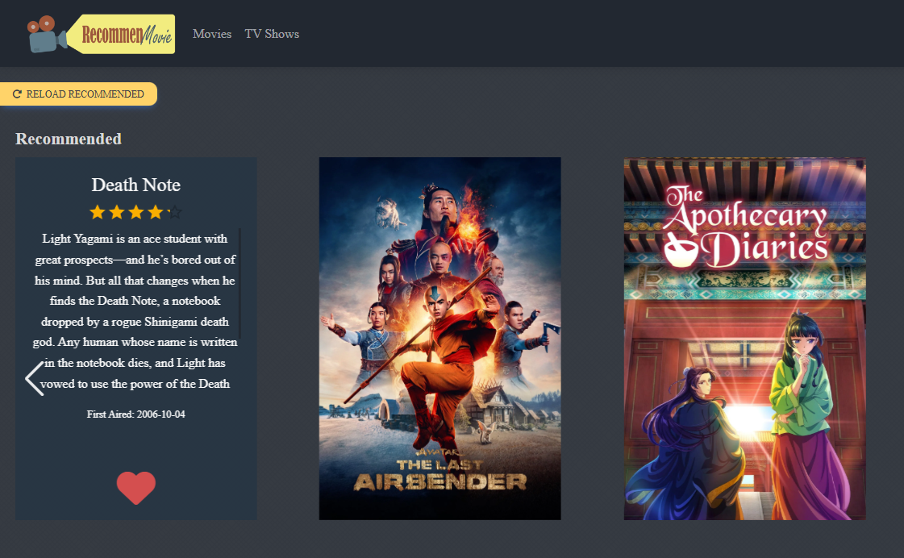
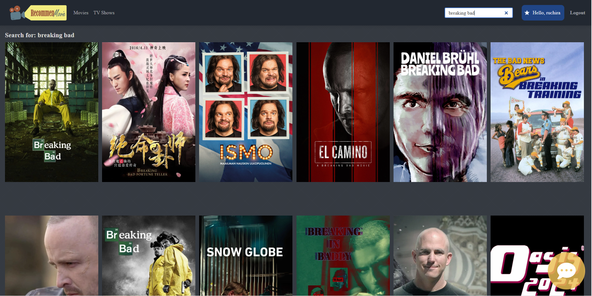
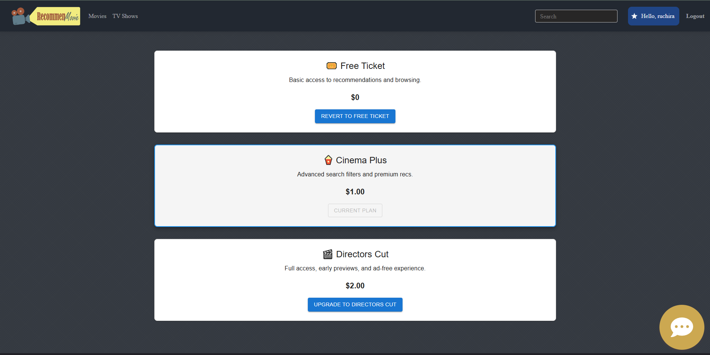
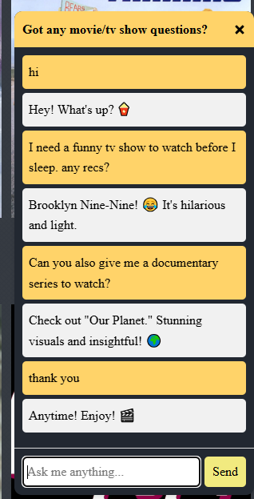

## 🎬 Demo

Explore some of the core features of the AI Movie Recommender App with the screenshots below:

---

### 🏠 Homepage – Recommendations & Popular Picks

The landing page features recommended movies and trending/popular picks to get you started right away.

---

### ❤️ Movie & TV Show Cards – Like and Refine Your Recs

Click on any movie/show to view its info. You can **like** it to update your recommendation feed based on your taste.

---

### 🔍 Search Functionality

Easily search for any movie or TV show using the built-in search bar in the top right corner.

---

### 🎟️ Subscription Tiers

Choose from 3 access levels:
- **Free Ticket** 🎫 – Basic access  
- **Cinema Plus** 🍿 – Unlock advanced filters  
- **Directors Cut** 🎬 – Full features + no ads  

---

### 🤖 AI Chatbot Assistant

Integrated with the **ChatGPT API**, the chatbot helps users get specific recommendations and answer any movie/TV-related questions in a conversational way.

---
